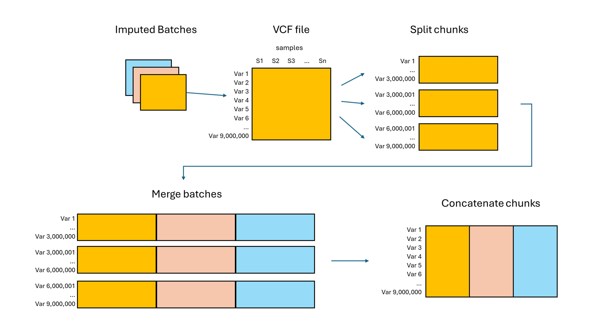

# Dependencies
[cyvcf2 v0.31.1](https://github.com/brentp/cyvcf2)  
[IMMerge](https://github.com/belowlab/IMMerge)  

# Process

  1. Create a list of imputed vcf files as the sample list.
  2. Remain only genotypes to reduce file size and generate .info.gz file by IMMerge. [bcftools_remain_gt_Info.sh](scripts/bcftools_remain_gt_Info.sh)  
  3. Create a list of vcf files that remain only genotypes.
  4. Calculate chunks for each chromosome (default: 3,000,000 variants/chunk; can adjust the number of variants according to the memory usage). [chunk_vcf_by_counts.py](scripts/chunk_vcf_by_counts.py)  
  5. Split vcf file and .info.gz according to pre-calculated chunks (generate from step 2). [bcftools_chunk_infos.sh](scripts/bcftools_chunk_infos.sh)  
  6. Merge all batches for each chunk. [IMMerge_chunks.sh](scripts/IMMerge_chunks.sh)  
  7. Concat all chunks together for each chromosome. [bcftools_concat.sh](scripts/bcftools_concat.sh)  
